# 인프라 구성도 (Infrastructure Diagram)

## 📋 개요

콘서트 예약 서비스의 전체 인프라 구성을 시각화한 문서입니다. 클라이언트부터 데이터베이스까지의 전체 시스템 구조와 네트워크 플로우를 보여줍니다.

---

```mermaid
graph LR
subgraph "사용자 및 접근"
Developer[👨‍💻 개발자<br/>배포/디버깅]
Admin[🔧 서버 관리자<br/>모니터링/운영]
User[👤 일반 사용자<br/>콘서트 예약]
end

subgraph "로드밸런서 계층"
LB[⚖️ Load Balancer<br/>203.0.113.10<br/>트래픽 분산]
end

subgraph "Private Network (10.0.0.0/16)"
subgraph "Application Layer (10.0.1.0/24)"
App1[🚀 App Server 1<br/>10.0.1.11:8080<br/>대기열 + 예약 처리]
App2[🚀 App Server 2<br/>10.0.1.12:8080<br/>대기열 + 예약 처리]
App3[🚀 App Server 3<br/>10.0.1.13:8080<br/>대기열 + 예약 처리]
end

subgraph "Queue & Cache Layer (10.0.2.0/24)"
RabbitMQ[🐰 RabbitMQ<br/>10.0.2.10:5672<br/>예약 요청 대기열<br/>FIFO 순서 보장]
Redis[🔴 Redis<br/>10.0.2.20:6379<br/>• 대기열 토큰 저장<br/>• 임시 좌석 배정<br/>• 분산 락 처리]
end

subgraph "Database Layer (10.0.3.0/24)"
MySQL_Master[🗄️ MySQL Master<br/>10.0.3.20:3306<br/>• 예약/결제 데이터<br/>• 좌석 상태 관리<br/>• 사용자 잔액]
MySQL_Slave[🗄️ MySQL Slave<br/>10.0.3.21:3306<br/>• 콘서트 정보 조회<br/>• 좌석 현황 조회<br/>• 대시보드 데이터]
end
end

%% 사용자 접근 플로우
User --> LB
Developer --> LB
Admin --> LB

%% 로드밸런서 분산
LB --> App1
LB --> App2
LB --> App3

%% 애플리케이션 - 큐/캐시 연결
App1 --> RabbitMQ
App2 --> RabbitMQ
App3 --> RabbitMQ

App1 --> Redis
App2 --> Redis
App3 --> Redis

%% 애플리케이션 - 데이터베이스 연결
App1 --> MySQL_Master
App1 --> MySQL_Slave
App2 --> MySQL_Master
App2 --> MySQL_Slave
App3 --> MySQL_Master
App3 --> MySQL_Slave

%% 데이터베이스 복제
MySQL_Master -.->|실시간 복제| MySQL_Slave

%% 스타일링
style User fill:#fce4ec,stroke:#880e4f,stroke-width:2px
style Developer fill:#e3f2fd,stroke:#0d47a1,stroke-width:2px
style Admin fill:#e8f5e8,stroke:#1b5e20,stroke-width:2px
style LB fill:#f3e5f5,stroke:#4a148c,stroke-width:2px
style App1 fill:#e8f5e8,stroke:#1b5e20,stroke-width:2px
style App2 fill:#e8f5e8,stroke:#1b5e20,stroke-width:2px
style App3 fill:#e8f5e8,stroke:#1b5e20,stroke-width:2px
style RabbitMQ fill:#fff8e1,stroke:#f57c00,stroke-width:2px
style Redis fill:#ffebee,stroke:#b71c1c,stroke-width:2px
style MySQL_Master fill:#fff3e0,stroke:#e65100,stroke-width:2px
style MySQL_Slave fill:#fff3e0,stroke:#e65100,stroke-width:2px
```

