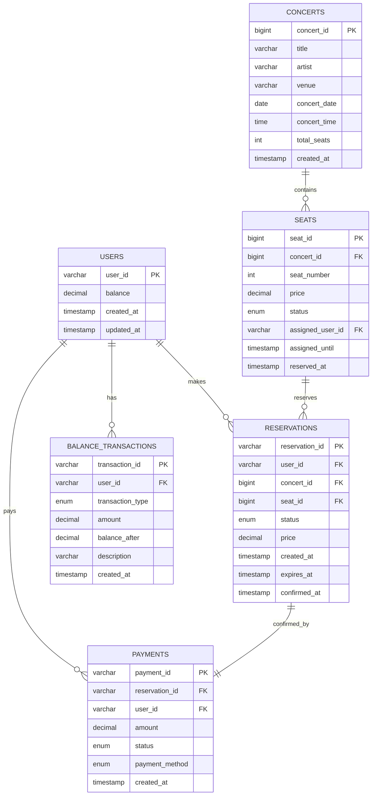

# 데이터베이스 ERD 설계 (Entity Relationship Diagram)

## 📋 개요

콘서트 예약 서비스의 데이터베이스 설계 문서입니다. MySQL과 Redis를 혼합하여 사용합니다.

### 데이터베이스 구성
- **MySQL**: 영구 데이터 저장 (사용자, 콘서트, 예약, 결제)
- **Redis**: 임시 데이터 및 캐시 (대기열, 분산 락, 캐시)

---

## 🔗 전체 ERD (Mermaid)



---

## 🗄️ MySQL 테이블 설계

### 1. users (사용자)

**사용자 기본 정보를 관리하는 테이블**

| 컬럼명 | 데이터 타입 | 제약조건 | 기본값 | 설명 |
|--------|-------------|----------|--------|------|
| user_id | VARCHAR(50) | PRIMARY KEY | - | 사용자 식별자 |
| balance | DECIMAL(15,2) | NOT NULL | 0 | 현재 잔액 (원) |
| created_at | TIMESTAMP | NOT NULL | CURRENT_TIMESTAMP | 생성일시 |
| updated_at | TIMESTAMP | NOT NULL | CURRENT_TIMESTAMP ON UPDATE | 수정일시 |

#### DDL
```sql
CREATE TABLE users (
    user_id VARCHAR(50) PRIMARY KEY,
    balance DECIMAL(15,2) NOT NULL DEFAULT 0 COMMENT '사용자 잔액',
    created_at TIMESTAMP DEFAULT CURRENT_TIMESTAMP,
    updated_at TIMESTAMP DEFAULT CURRENT_TIMESTAMP ON UPDATE CURRENT_TIMESTAMP,
    
    CONSTRAINT chk_balance CHECK (balance >= 0)
) COMMENT '사용자 정보';
```

#### 인덱스
```sql
CREATE INDEX idx_users_created_at ON users(created_at);
```

---

### 2. concerts (콘서트)

**콘서트 기본 정보를 관리하는 테이블**

| 컬럼명 | 데이터 타입 | 제약조건 | 기본값 | 설명 |
|--------|-------------|----------|--------|------|
| concert_id | BIGINT | PRIMARY KEY AUTO_INCREMENT | - | 콘서트 ID |
| title | VARCHAR(200) | NOT NULL | - | 콘서트 제목 |
| artist | VARCHAR(100) | NOT NULL | - | 아티스트명 |
| venue | VARCHAR(200) | NOT NULL | - | 공연장 |
| concert_date | DATE | NOT NULL | - | 공연 날짜 |
| concert_time | TIME | NOT NULL | - | 공연 시간 |
| total_seats | INT | NOT NULL | 50 | 총 좌석 수 |
| created_at | TIMESTAMP | NOT NULL | CURRENT_TIMESTAMP | 생성일시 |

#### DDL
```sql
CREATE TABLE concerts (
    concert_id BIGINT PRIMARY KEY AUTO_INCREMENT,
    title VARCHAR(200) NOT NULL COMMENT '콘서트 제목',
    artist VARCHAR(100) NOT NULL COMMENT '아티스트명',
    venue VARCHAR(200) NOT NULL COMMENT '공연장',
    concert_date DATE NOT NULL COMMENT '공연 날짜',
    concert_time TIME NOT NULL COMMENT '공연 시간',
    total_seats INT NOT NULL DEFAULT 50 COMMENT '총 좌석 수',
    created_at TIMESTAMP DEFAULT CURRENT_TIMESTAMP,
    
    CONSTRAINT chk_total_seats CHECK (total_seats > 0),
    CONSTRAINT chk_concert_date CHECK (concert_date >= CURDATE())
) COMMENT '콘서트 정보';
```

#### 인덱스
```sql
CREATE INDEX idx_concerts_date ON concerts(concert_date);
CREATE INDEX idx_concerts_artist ON concerts(artist);
```

---

### 3. seats (좌석)

**콘서트별 좌석 정보 및 예약 상태를 관리하는 테이블**

| 컬럼명 | 데이터 타입 | 제약조건 | 기본값 | 설명 |
|--------|-------------|----------|--------|------|
| seat_id | BIGINT | PRIMARY KEY AUTO_INCREMENT | - | 좌석 ID |
| concert_id | BIGINT | NOT NULL, FK | - | 콘서트 ID |
| seat_number | INT | NOT NULL | - | 좌석 번호 (1-50) |
| price | DECIMAL(10,2) | NOT NULL | - | 좌석 가격 |
| status | ENUM | NOT NULL | 'AVAILABLE' | 좌석 상태 |
| assigned_user_id | VARCHAR(50) | NULL, FK | NULL | 임시 배정된 사용자 |
| assigned_until | TIMESTAMP | NULL | NULL | 임시 배정 만료 시간 |
| reserved_at | TIMESTAMP | NULL | NULL | 확정 예약 시간 |

#### Status ENUM 값
- `AVAILABLE`: 예약 가능
- `TEMPORARILY_ASSIGNED`: 임시 배정 중 (5분간)
- `RESERVED`: 예약 완료

#### DDL
```sql
CREATE TABLE seats (
    seat_id BIGINT PRIMARY KEY AUTO_INCREMENT,
    concert_id BIGINT NOT NULL,
    seat_number INT NOT NULL,
    price DECIMAL(10,2) NOT NULL,
    status ENUM('AVAILABLE', 'TEMPORARILY_ASSIGNED', 'RESERVED') 
           NOT NULL DEFAULT 'AVAILABLE',
    assigned_user_id VARCHAR(50) NULL,
    assigned_until TIMESTAMP NULL,
    reserved_at TIMESTAMP NULL,
    
    FOREIGN KEY (concert_id) REFERENCES concerts(concert_id),
    FOREIGN KEY (assigned_user_id) REFERENCES users(user_id),
    
    UNIQUE KEY uk_concert_seat (concert_id, seat_number),
    CONSTRAINT chk_seat_number CHECK (seat_number BETWEEN 1 AND 50),
    CONSTRAINT chk_price CHECK (price > 0)
) COMMENT '좌석 정보';
```

#### 인덱스
```sql
CREATE INDEX idx_seats_concert_status ON seats(concert_id, status);
CREATE INDEX idx_seats_assigned_until ON seats(assigned_until);
CREATE INDEX idx_seats_assigned_user ON seats(assigned_user_id);
```

---

### 4. reservations (예약)

**좌석 예약 정보를 관리하는 테이블**

| 컬럼명 | 데이터 타입 | 제약조건 | 기본값 | 설명 |
|--------|-------------|----------|--------|------|
| reservation_id | VARCHAR(36) | PRIMARY KEY | - | 예약 ID (UUID) |
| user_id | VARCHAR(50) | NOT NULL, FK | - | 사용자 ID |
| concert_id | BIGINT | NOT NULL, FK | - | 콘서트 ID |
| seat_id | BIGINT | NOT NULL, FK | - | 좌석 ID |
| status | ENUM | NOT NULL | 'TEMPORARILY_ASSIGNED' | 예약 상태 |
| price | DECIMAL(10,2) | NOT NULL | - | 예약 가격 |
| created_at | TIMESTAMP | NOT NULL | CURRENT_TIMESTAMP | 예약 생성일시 |
| expires_at | TIMESTAMP | NOT NULL | - | 임시 배정 만료일시 |
| confirmed_at | TIMESTAMP | NULL | NULL | 예약 확정일시 |

#### Status ENUM 값
- `TEMPORARILY_ASSIGNED`: 임시 배정 중
- `CONFIRMED`: 결제 완료로 확정
- `CANCELLED`: 사용자 취소
- `EXPIRED`: 시간 만료로 자동 취소

#### DDL
```sql
CREATE TABLE reservations (
    reservation_id VARCHAR(36) PRIMARY KEY,
    user_id VARCHAR(50) NOT NULL,
    concert_id BIGINT NOT NULL,
    seat_id BIGINT NOT NULL,
    status ENUM('TEMPORARILY_ASSIGNED', 'CONFIRMED', 'CANCELLED', 'EXPIRED') 
           NOT NULL DEFAULT 'TEMPORARILY_ASSIGNED',
    price DECIMAL(10,2) NOT NULL,
    created_at TIMESTAMP DEFAULT CURRENT_TIMESTAMP,
    expires_at TIMESTAMP NOT NULL,
    confirmed_at TIMESTAMP NULL,
    
    FOREIGN KEY (user_id) REFERENCES users(user_id),
    FOREIGN KEY (concert_id) REFERENCES concerts(concert_id),
    FOREIGN KEY (seat_id) REFERENCES seats(seat_id),
    
    CONSTRAINT chk_price CHECK (price > 0),
    CONSTRAINT chk_expires_at CHECK (expires_at > created_at)
) COMMENT '예약 정보';
```

#### 인덱스
```sql
CREATE INDEX idx_reservations_user_status ON reservations(user_id, status);
CREATE INDEX idx_reservations_expires_at ON reservations(expires_at);
CREATE INDEX idx_reservations_seat ON reservations(seat_id);
CREATE INDEX idx_reservations_created_at ON reservations(created_at);
```

---

### 5. payments (결제)

**결제 정보를 관리하는 테이블**

| 컬럼명 | 데이터 타입 | 제약조건 | 기본값 | 설명 |
|--------|-------------|----------|--------|------|
| payment_id | VARCHAR(36) | PRIMARY KEY | - | 결제 ID (UUID) |
| reservation_id | VARCHAR(36) | NOT NULL, FK | - | 예약 ID |
| user_id | VARCHAR(50) | NOT NULL, FK | - | 사용자 ID |
| amount | DECIMAL(10,2) | NOT NULL | - | 결제 금액 |
| status | ENUM | NOT NULL | 'COMPLETED' | 결제 상태 |
| payment_method | ENUM | NOT NULL | 'BALANCE' | 결제 수단 |
| created_at | TIMESTAMP | NOT NULL | CURRENT_TIMESTAMP | 결제일시 |

#### Status ENUM 값
- `COMPLETED`: 결제 완료
- `FAILED`: 결제 실패
- `CANCELLED`: 결제 취소

#### Payment Method ENUM 값
- `BALANCE`: 충전된 잔액

#### DDL
```sql
CREATE TABLE payments (
    payment_id VARCHAR(36) PRIMARY KEY,
    reservation_id VARCHAR(36) NOT NULL,
    user_id VARCHAR(50) NOT NULL,
    amount DECIMAL(10,2) NOT NULL,
    status ENUM('COMPLETED', 'FAILED', 'CANCELLED') NOT NULL DEFAULT 'COMPLETED',
    payment_method ENUM('BALANCE') NOT NULL DEFAULT 'BALANCE',
    created_at TIMESTAMP DEFAULT CURRENT_TIMESTAMP,
    
    FOREIGN KEY (reservation_id) REFERENCES reservations(reservation_id),
    FOREIGN KEY (user_id) REFERENCES users(user_id),
    
    CONSTRAINT chk_amount CHECK (amount > 0)
) COMMENT '결제 정보';
```

#### 인덱스
```sql
CREATE INDEX idx_payments_user ON payments(user_id);
CREATE INDEX idx_payments_reservation ON payments(reservation_id);
CREATE INDEX idx_payments_created_at ON payments(created_at);
```

---

### 6. balance_transactions (잔액 거래 내역)

**사용자 잔액 변동 내역을 관리하는 테이블**

| 컬럼명 | 데이터 타입 | 제약조건 | 기본값 | 설명 |
|--------|-------------|----------|--------|------|
| transaction_id | VARCHAR(36) | PRIMARY KEY | - | 거래 ID (UUID) |
| user_id | VARCHAR(50) | NOT NULL, FK | - | 사용자 ID |
| transaction_type | ENUM | NOT NULL | - | 거래 유형 |
| amount | DECIMAL(15,2) | NOT NULL | - | 거래 금액 |
| balance_after | DECIMAL(15,2) | NOT NULL | - | 거래 후 잔액 |
| description | VARCHAR(500) | NULL | NULL | 거래 설명 |
| created_at | TIMESTAMP | NOT NULL | CURRENT_TIMESTAMP | 거래일시 |

#### Transaction Type ENUM 값
- `CHARGE`: 잔액 충전
- `PAYMENT`: 결제로 인한 차감
- `REFUND`: 환불

#### DDL
```sql
CREATE TABLE balance_transactions (
    transaction_id VARCHAR(36) PRIMARY KEY,
    user_id VARCHAR(50) NOT NULL,
    transaction_type ENUM('CHARGE', 'PAYMENT', 'REFUND') NOT NULL,
    amount DECIMAL(15,2) NOT NULL,
    balance_after DECIMAL(15,2) NOT NULL,
    description VARCHAR(500) NULL,
    created_at TIMESTAMP DEFAULT CURRENT_TIMESTAMP,
    
    FOREIGN KEY (user_id) REFERENCES users(user_id),
    
    CONSTRAINT chk_balance_after CHECK (balance_after >= 0)
) COMMENT '잔액 거래 내역';
```

#### 인덱스
```sql
CREATE INDEX idx_balance_transactions_user_created ON balance_transactions(user_id, created_at);
CREATE INDEX idx_balance_transactions_type ON balance_transactions(transaction_type);
```

---

## 🔴 Redis 데이터 구조

### 1. 대기열 토큰 관리

#### 토큰 정보 저장
```redis
# Key: queue_token:{token_uuid}
# Value: JSON string
# TTL: 3600초 (1시간)

SET "queue_token:550e8400-e29b-41d4-a716-446655440000" 
    "{\"user_id\":\"user-123\",\"position\":150,\"status\":\"WAITING\",\"issued_at\":\"2025-05-29T15:20:00Z\"}" 
    EX 3600
```

#### 대기열 순서 관리 (Sorted Set)
```redis
# Key: queue:waiting
# Score: timestamp (요청 시간)
# Member: user_id

ZADD "queue:waiting" 1704067200 "user-123"
ZADD "queue:waiting" 1704067201 "user-456"
```

#### 활성 사용자 관리 (Set)
```redis
# Key: queue:active
# Members: 현재 활성 상태인 user_id들

SADD "queue:active" "user-123"
EXPIRE "queue:active:user-123" 1800  # 30분 후 개별 만료
```

### 2. 분산 락 (좌석 예약용)

```redis
# Key: seat_lock:{concert_id}:{seat_number}
# Value: user_id (락을 획득한 사용자)
# TTL: 10초 (짧은 시간)

SET "seat_lock:1:15" "user-123" EX 10 NX
```

### 3. 캐시 데이터

#### 콘서트 정보 캐시
```redis
# Key: concert:available_dates
# Value: JSON string (콘서트 목록)
# TTL: 600초 (10분)

SET "concert:available_dates" 
    "[{\"concertId\":1,\"title\":\"2025 Spring Concert\",\"date\":\"2025-06-01\"}]" 
    EX 600
```

#### 사용자 잔액 캐시
```redis
# Key: user_balance:{user_id}
# Value: balance amount
# TTL: 60초 (1분)

SET "user_balance:user-123" "150000" EX 60
```

---

## 🔗 테이블 관계 및 제약조건

### 외래키 관계
```
users (1) ←──────── (N) reservations
users (1) ←──────── (N) payments  
users (1) ←──────── (N) balance_transactions
users (1) ←──────── (N) seats (assigned_user_id)

concerts (1) ←──── (N) seats
concerts (1) ←──── (N) reservations

seats (1) ←─────── (N) reservations

reservations (1) ← (1) payments
```

### 비즈니스 제약조건

#### 1. 좌석 상태 일관성
- `seats.status = 'TEMPORARILY_ASSIGNED'` ↔ `reservations.status = 'TEMPORARILY_ASSIGNED'`
- `seats.status = 'RESERVED'` ↔ `reservations.status = 'CONFIRMED'`

#### 2. 임시 배정 시간 제한
- `seats.assigned_until`은 생성 시점 + 5분
- `reservations.expires_at`와 동일해야 함

#### 3. 결제 완료 조건
- `payments.status = 'COMPLETED'` → `reservations.status = 'CONFIRMED'`
- `payments.amount = reservations.price`

#### 4. 잔액 일관성
- `users.balance` = 최신 `balance_transactions.balance_after`
- 모든 거래는 `balance_transactions`에 기록

---

## 📊 성능 최적화

### 1. 인덱스 전략

#### 복합 인덱스
```sql
-- 좌석 조회 최적화
CREATE INDEX idx_seats_concert_status ON seats(concert_id, status);

-- 사용자 예약 내역 조회
CREATE INDEX idx_reservations_user_status ON reservations(user_id, status);

-- 잔액 거래 내역 조회 (시간 순)
CREATE INDEX idx_balance_transactions_user_created ON balance_transactions(user_id, created_at);
```

#### 커버링 인덱스
```sql
-- 좌석 목록 조회 시 price도 함께 조회
CREATE INDEX idx_seats_concert_status_price ON seats(concert_id, status, price);
```

### 2. 파티셔닝 고려사항

#### 시간 기반 파티셔닝 (대용량 서비스 시)
```sql
-- balance_transactions 테이블 월별 파티셔닝
ALTER TABLE balance_transactions 
PARTITION BY RANGE (YEAR(created_at) * 100 + MONTH(created_at)) (
    PARTITION p202501 VALUES LESS THAN (202502),
    PARTITION p202502 VALUES LESS THAN (202503),
    -- ...
);
```

### 3. Redis 최적화

#### 메모리 사용량 최적화
```redis
# Hash 구조로 메모리 절약
HMSET "queue_token:user-123" 
       "position" 150
       "status" "WAITING" 
       "issued_at" "2025-05-29T15:20:00Z"
EXPIRE "queue_token:user-123" 3600
```

#### 배치 처리
```redis
# Pipeline으로 여러 명령어 한 번에 처리
PIPELINE
    ZADD "queue:waiting" 1704067200 "user-123"
    SET "queue_token:user-123" "..." EX 3600
    SADD "queue:active_check" "user-123"
EXEC
```

---

## 🔄 데이터 라이프사이클

### 1. 좌석 예약 플로우
```
1. 좌석 상태: AVAILABLE
2. 임시 배정: TEMPORARILY_ASSIGNED (5분)
3. 결제 완료: RESERVED
4. 또는 만료: AVAILABLE (자동 해제)
```

### 2. 대기열 토큰 플로우
```
1. 토큰 발급: WAITING 상태로 Redis 저장
2. 순서 도래: ACTIVE 상태로 변경
3. 서비스 이용: 활성 상태 유지
4. 결제 완료 또는 만료: 토큰 삭제
```

### 3. 데이터 정리 작업

#### MySQL 스케줄러
```sql
-- 만료된 임시 배정 자동 해제 (30초마다)
CREATE EVENT auto_release_expired_seats
ON SCHEDULE EVERY 30 SECOND
DO
    UPDATE seats 
    SET status = 'AVAILABLE', 
        assigned_user_id = NULL, 
        assigned_until = NULL
    WHERE status = 'TEMPORARILY_ASSIGNED' 
      AND assigned_until < NOW();
```

#### Redis TTL
- 대기열 토큰: 1시간 자동 만료
- 분산 락: 10초 자동 해제
- 캐시 데이터: 용도별 TTL 설정

---

## 📚 관련 문서

- [요구사항 명세서](./requirements.md)
- [API 명세서](./api-spec.md)
- [시퀀스 다이어그램](./sequence-diagrams.md)
- [시스템 아키텍처](./architecture.md)