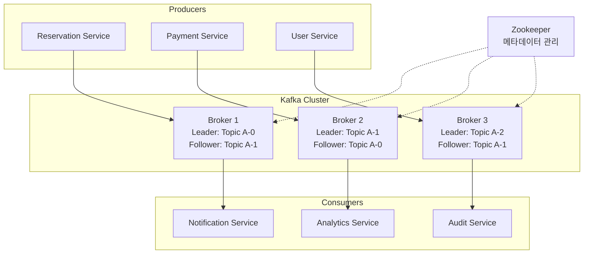
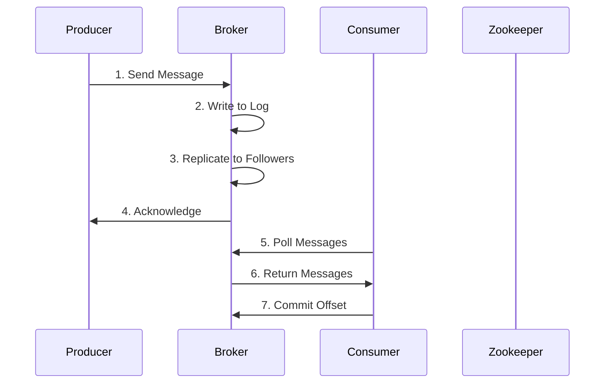
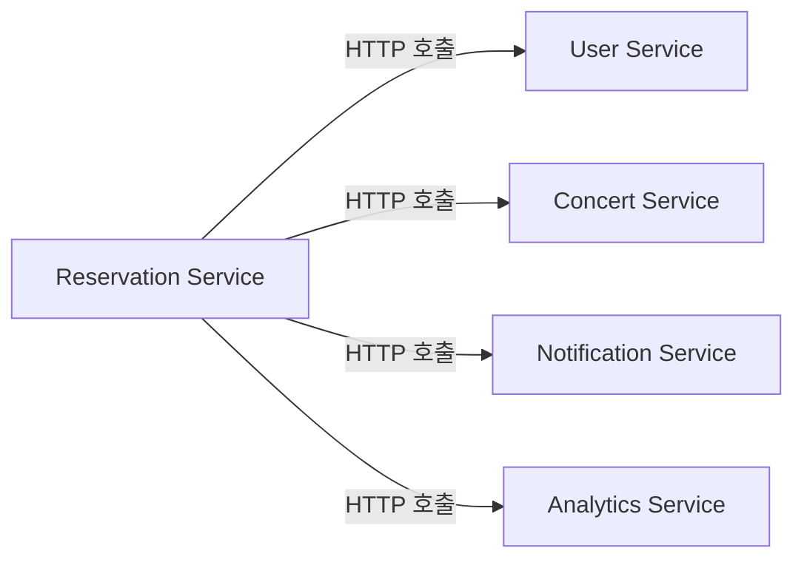
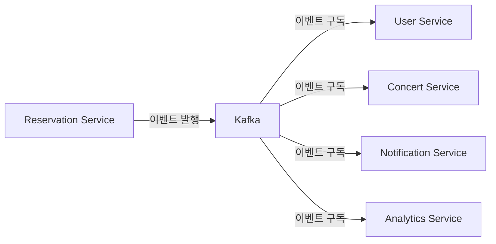

# Apache Kafka 기초 개념 

## 📋 목차
1. [Kafka란 무엇인가?](#1-kafka란-무엇인가)
2. [Kafka의 핵심 개념](#2-kafka의-핵심-개념)
3. [Kafka의 장단점](#3-kafka의-장단점)
4. [Kafka 아키텍처](#4-kafka-아키텍처)
5. [이벤트 기반 시스템으로의 확장](#5-이벤트-기반-시스템으로의-확장)
6. [Kafka 설치 및 기본 사용법](#6-kafka-설치-및-기본-사용법)
7. [콘서트 예약 시스템에 Kafka 적용](#7-콘서트-예약-시스템에-kafka-적용)

---

## 1. Kafka란 무엇인가?

### 1.1 정의
**Apache Kafka**는 LinkedIn에서 개발한 **분산 스트리밍 플랫폼**으로, 실시간으로 대용량 데이터를 처리할 수 있는 메시지 큐 시스템입니다.

### 1.2 핵심 특징
- **높은 처리량**: 초당 수백만 개의 메시지 처리 가능
- **내구성**: 데이터를 디스크에 영구 저장
- **확장성**: 수평적 확장 지원
- **실시간 처리**: 낮은 지연시간으로 실시간 스트리밍

### 1.3 사용 사례
```
✅ 실시간 로그 수집 및 분석
✅ 마이크로서비스 간 이벤트 전달
✅ 실시간 데이터 파이프라인 구축
✅ 활동 추적 및 모니터링
✅ 스트림 프로세싱
```

---

## 2. Kafka의 핵심 개념

### 2.1 주요 구성 요소

#### 🔸 **Topic (토픽)**
- 메시지가 저장되는 **논리적 채널**
- 데이터베이스의 테이블과 유사한 개념
- 예: `user-events`, `order-events`, `reservation-events`

#### 🔸 **Partition (파티션)**
- 토픽을 물리적으로 분할한 단위
- **병렬 처리**와 **확장성**을 위해 사용
- 각 파티션은 **순서가 보장**됨

```
Topic: reservation-events
├── Partition 0: [msg1, msg2, msg3]
├── Partition 1: [msg4, msg5, msg6]
└── Partition 2: [msg7, msg8, msg9]
```

#### 🔸 **Producer (프로듀서)**
- 메시지를 **생성하고 전송**하는 애플리케이션
- 어떤 파티션에 메시지를 보낼지 결정

```java
// Producer 예시
@Service
public class ReservationEventProducer {
    
    @Autowired
    private KafkaTemplate<String, Object> kafkaTemplate;
    
    public void sendReservationEvent(ReservationCreatedEvent event) {
        kafkaTemplate.send("reservation-events", event);
    }
}
```

#### 🔸 **Consumer (컨슈머)**
- 메시지를 **읽고 처리**하는 애플리케이션
- **Consumer Group**을 통해 병렬 처리

```java
// Consumer 예시
@KafkaListener(topics = "reservation-events", groupId = "notification-service")
public void handleReservationEvent(ReservationCreatedEvent event) {
    // 알림 발송 로직
    notificationService.sendConfirmation(event);
}
```

#### 🔸 **Broker (브로커)**
- Kafka **서버 인스턴스**
- 메시지 저장, 복제, 전달 담당
- 여러 브로커가 **클러스터**를 구성

#### 🔸 **Zookeeper**
- Kafka 클러스터의 **메타데이터 관리**
- 브로커 상태 모니터링
- 리더 선출 및 설정 관리

### 2.2 메시지 구조

```json
{
  "key": "user-123",
  "value": {
    "eventType": "RESERVATION_CREATED",
    "reservationId": 456,
    "userId": 123,
    "concertId": 789,
    "timestamp": "2025-01-15T10:30:00Z"
  },
  "partition": 1,
  "offset": 12345,
  "timestamp": 1705315800000
}
```

---

## 3. Kafka의 장단점

### 3.1 장점 ✅

#### **🚀 높은 성능**
- **초당 수백만 메시지** 처리 가능
- **낮은 지연시간** (1-5ms)
- **순차 I/O** 최적화로 빠른 처리

#### **📈 확장성**
- **수평적 확장** 지원 (브로커/파티션 추가)
- **Consumer Group**을 통한 병렬 처리
- **클러스터 운영** 중에도 확장 가능

#### **🛡️ 내구성 및 안정성**
- **디스크 영구 저장** (데이터 손실 방지)
- **복제(Replication)** 를 통한 고가용성
- **리더-팔로워** 구조로 장애 복구

#### **🔄 유연성**
- **다양한 데이터 포맷** 지원 (JSON, Avro, Protobuf)
- **스키마 진화** 지원
- **다중 Consumer** 지원 (같은 데이터를 여러 서비스가 처리)

#### **🕰️ 시간 기반 처리**
- **타임스탬프 기반** 메시지 처리
- **시간 윈도우** 기반 집계
- **이벤트 시간** vs **처리 시간** 구분

### 3.2 단점 ❌

#### **🧩 복잡성**
- **학습 곡선** 높음
- **설정 및 튜닝** 복잡
- **운영 관리** 오버헤드

#### **🗄️ 저장소 요구사항**
- **디스크 공간** 많이 필요
- **메모리 사용량** 높음
- **로그 관리** 필요

#### **🌐 네트워크 의존성**
- **네트워크 지연** 영향
- **브로커 간 통신** 오버헤드
- **Zookeeper 의존성**

#### **🔧 운영 복잡도**
- **클러스터 관리** 복잡
- **모니터링** 필수
- **백업/복구** 전략 필요

---

## 4. Kafka 아키텍처

### 4.1 전체 아키텍처



### 4.2 데이터 흐름



---

## 5. 이벤트 기반 시스템으로의 확장

### 5.1 기존 시스템 vs 이벤트 기반 시스템

#### **Before: 동기식 호출**

**문제점**: 하나라도 실패하면 전체 실패, 강한 결합도

#### **After: 이벤트 기반**

**장점**: 느슨한 결합, 장애 격리, 비동기 처리

### 5.2 이벤트 기반 아키텍처의 이점

#### **🔄 Loose Coupling (느슨한 결합)**
- 서비스 간 **직접적인 의존성 제거**
- **독립적인 배포 및 확장** 가능
- **인터페이스 변경** 영향 최소화

#### **⚡ Asynchronous Processing (비동기 처리)**
- **높은 처리량** 달성
- **응답 시간 개선**
- **시스템 전체 안정성** 향상

#### **📊 Event Sourcing**
- **모든 상태 변경을 이벤트로 기록**
- **완전한 감사 추적** (Audit Trail)
- **시점별 상태 복원** 가능

#### **🔍 Real-time Analytics**
- **실시간 데이터 분석**
- **스트림 프로세싱**
- **대시보드 및 모니터링**

### 5.3 콘서트 예약 시스템 이벤트 설계

```java
// 도메인 이벤트 정의
public abstract class DomainEvent {
    private String eventId = UUID.randomUUID().toString();
    private LocalDateTime occurredAt = LocalDateTime.now();
    private String eventType = this.getClass().getSimpleName();
}

// 예약 관련 이벤트들
public class ReservationCreatedEvent extends DomainEvent {
    private Long reservationId;
    private Long userId;
    private Long concertId;
    private Long seatId;
    private BigDecimal amount;
}

public class PaymentCompletedEvent extends DomainEvent {
    private Long paymentId;
    private Long reservationId;
    private BigDecimal amount;
    private String paymentMethod;
}

public class ConcertSoldOutEvent extends DomainEvent {
    private Long concertId;
    private LocalDateTime soldOutTime;
    private Integer totalSeats;
}
```

---

## 6. 실습: Kafka 설치 및 기본 사용법

### 6.1 Docker Compose를 통한 Kafka 클러스터 구성

**docker-compose.kafka.yaml** 파일 생성:

```yaml
version: '3.8'

services:
  zookeeper:
    image: confluentinc/cp-zookeeper:7.6.0
    hostname: zookeeper
    container_name: zookeeper
    ports:
      - "2181:2181"
    environment:
      ZOOKEEPER_CLIENT_PORT: 2181
      ZOOKEEPER_TICK_TIME: 2000

  broker1:
    image: confluentinc/cp-kafka:7.6.0
    hostname: broker1
    container_name: broker1
    ports:
      - "9092:9092"
    depends_on:
      - zookeeper
    environment:
      KAFKA_BROKER_ID: 1
      KAFKA_ZOOKEEPER_CONNECT: 'zookeeper:2181'
      KAFKA_LISTENER_SECURITY_PROTOCOL_MAP: PLAINTEXT:PLAINTEXT,PLAINTEXT_HOST:PLAINTEXT
      KAFKA_ADVERTISED_LISTENERS: PLAINTEXT://broker1:29092,PLAINTEXT_HOST://localhost:9092
      KAFKA_OFFSETS_TOPIC_REPLICATION_FACTOR: 3
      KAFKA_TRANSACTION_STATE_LOG_MIN_ISR: 2
      KAFKA_TRANSACTION_STATE_LOG_REPLICATION_FACTOR: 3
      KAFKA_LOG_RETENTION_MS: 604800000
      KAFKA_LOG_RETENTION_BYTES: 1073741824

  broker3:
    image: confluentinc/cp-kafka:7.6.0
    hostname: broker3
    container_name: broker3
    ports:
      - "9094:9094"
    depends_on:
      - zookeeper
    environment:
      KAFKA_BROKER_ID: 3
      KAFKA_ZOOKEEPER_CONNECT: 'zookeeper:2181'
      KAFKA_LISTENER_SECURITY_PROTOCOL_MAP: PLAINTEXT:PLAINTEXT,PLAINTEXT_HOST:PLAINTEXT
      KAFKA_ADVERTISED_LISTENERS: PLAINTEXT://broker3:29094,PLAINTEXT_HOST://localhost:9094
      KAFKA_OFFSETS_TOPIC_REPLICATION_FACTOR: 3
      KAFKA_TRANSACTION_STATE_LOG_MIN_ISR: 2
      KAFKA_TRANSACTION_STATE_LOG_REPLICATION_FACTOR: 3
      KAFKA_LOG_RETENTION_MS: 604800000
      KAFKA_LOG_RETENTION_BYTES: 1073741824

  kafka-ui:
    image: provectuslabs/kafka-ui:latest
    container_name: kafka-ui
    ports:
      - "8080:8080"
    depends_on:
      - broker1
      - broker2
      - broker3
    environment:
      KAFKA_CLUSTERS_0_NAME: local
      KAFKA_CLUSTERS_0_BOOTSTRAPSERVERS: broker1:29092,broker2:29093,broker3:29094
      KAFKA_CLUSTERS_0_ZOOKEEPER: zookeeper:2181
```

### 6.2 Kafka 클러스터 실행

```bash
# Kafka 클러스터 시작
docker-compose -f docker-compose.kafka.yaml up -d

# 상태 확인
docker-compose -f docker-compose.kafka.yaml ps

# 로그 확인
docker-compose -f docker-compose.kafka.yaml logs -f broker1
```

### 6.3 기본 Kafka 명령어 실습

#### **토픽 생성**
```bash
# 컨테이너 접속
docker exec -it broker1 bash

# 토픽 생성
kafka-topics --create \
  --bootstrap-server localhost:9092 \
  --topic reservation-events \
  --partitions 3 \
  --replication-factor 3

# 토픽 목록 확인
kafka-topics --list --bootstrap-server localhost:9092

# 토픽 상세 정보 확인
kafka-topics --describe \
  --bootstrap-server localhost:9092 \
  --topic reservation-events
```

#### **메시지 생산 (Producer)**
```bash
# 메시지 전송
kafka-console-producer \
  --bootstrap-server localhost:9092 \
  --topic reservation-events

# 입력 예시:
{"eventType":"RESERVATION_CREATED","reservationId":1,"userId":123,"concertId":456}
{"eventType":"PAYMENT_COMPLETED","reservationId":1,"amount":50000}
```

#### **메시지 소비 (Consumer)**
```bash
# 새로운 터미널에서 실행
docker exec -it broker1 bash

# 메시지 수신
kafka-console-consumer \
  --bootstrap-server localhost:9092 \
  --topic reservation-events \
  --from-beginning
```

### 6.4 Kafka UI를 통한 모니터링

브라우저에서 `http://localhost:8080` 접속하여:
- 토픽 목록 및 상세 정보 확인
- 메시지 내용 확인
- 파티션별 메시지 분포 확인
- Consumer Group 상태 모니터링

---

## 7. 콘서트 예약 시스템에 Kafka 적용

### 7.1 Spring Boot Kafka 설정

#### **의존성 추가 (build.gradle)**
```gradle
dependencies {
    implementation 'org.springframework.kafka:spring-kafka'
    implementation 'org.apache.kafka:kafka-streams'
    testImplementation 'org.springframework.kafka:spring-kafka-test'
}
```

#### **Kafka 설정 (application.yml)**
```yaml
spring:
  kafka:
    bootstrap-servers: localhost:9092,localhost:9093,localhost:9094
    producer:
      key-serializer: org.apache.kafka.common.serialization.StringSerializer
      value-serializer: org.springframework.kafka.support.serializer.JsonSerializer
      acks: all
      retries: 3
      properties:
        enable.idempotence: true
    consumer:
      group-id: concert-service
      key-deserializer: org.apache.kafka.common.serialization.StringDeserializer
      value-deserializer: org.springframework.kafka.support.serializer.JsonDeserializer
      auto-offset-reset: earliest
      properties:
        spring.json.trusted.packages: "kr.hhplus.be.server"
```

### 7.2 이벤트 클래스 정의

```java
// 기본 이벤트 클래스
@JsonTypeInfo(use = JsonTypeInfo.Id.NAME, property = "eventType")
@JsonSubTypes({
    @JsonSubTypes.Type(value = ReservationCreatedEvent.class, name = "RESERVATION_CREATED"),
    @JsonSubTypes.Type(value = PaymentCompletedEvent.class, name = "PAYMENT_COMPLETED"),
    @JsonSubTypes.Type(value = ConcertSoldOutEvent.class, name = "CONCERT_SOLD_OUT")
})
public abstract class DomainEvent {
    private String eventId = UUID.randomUUID().toString();
    private LocalDateTime occurredAt = LocalDateTime.now();
    private String eventType;
    
    // getters, setters, constructors
}

// 예약 생성 이벤트
public class ReservationCreatedEvent extends DomainEvent {
    private Long reservationId;
    private Long userId;
    private Long concertId;
    private Long seatId;
    private BigDecimal amount;
    private String userEmail;
    private String concertName;
    
    // constructors, getters, setters
}

// 결제 완료 이벤트
public class PaymentCompletedEvent extends DomainEvent {
    private Long paymentId;
    private Long reservationId;
    private Long userId;
    private BigDecimal amount;
    private String paymentMethod;
    
    // constructors, getters, setters
}

// 콘서트 매진 이벤트
public class ConcertSoldOutEvent extends DomainEvent {
    private Long concertId;
    private String concertName;
    private LocalDateTime soldOutTime;
    private LocalDateTime bookingStartTime;
    private Integer totalSeats;
    
    // constructors, getters, setters
}
```

### 7.3 Event Publisher 구현

```java
@Component
@RequiredArgsConstructor
@Slf4j
public class DomainEventPublisher {
    
    private final KafkaTemplate<String, Object> kafkaTemplate;
    
    public void publishReservationEvent(ReservationCreatedEvent event) {
        String topic = "reservation-events";
        String key = "reservation-" + event.getReservationId();
        
        kafkaTemplate.send(topic, key, event)
            .whenComplete((result, ex) -> {
                if (ex == null) {
                    log.info("예약 이벤트 발행 성공: {}", event.getEventId());
                } else {
                    log.error("예약 이벤트 발행 실패: {}", event.getEventId(), ex);
                }
            });
    }
    
    public void publishPaymentEvent(PaymentCompletedEvent event) {
        String topic = "payment-events";
        String key = "payment-" + event.getPaymentId();
        
        kafkaTemplate.send(topic, key, event)
            .whenComplete((result, ex) -> {
                if (ex == null) {
                    log.info("결제 이벤트 발행 성공: {}", event.getEventId());
                } else {
                    log.error("결제 이벤트 발행 실패: {}", event.getEventId(), ex);
                }
            });
    }
    
    public void publishConcertEvent(ConcertSoldOutEvent event) {
        String topic = "concert-events";
        String key = "concert-" + event.getConcertId();
        
        kafkaTemplate.send(topic, key, event)
            .whenComplete((result, ex) -> {
                if (ex == null) {
                    log.info("콘서트 이벤트 발행 성공: {}", event.getEventId());
                } else {
                    log.error("콘서트 이벤트 발행 실패: {}", event.getEventId(), ex);
                }
            });
    }
}
```

### 7.4 서비스 레이어에서 이벤트 발행

```java
@Service
@RequiredArgsConstructor
@Transactional
public class ReservationService {
    
    private final ReservationRepository reservationRepository;
    private final DomainEventPublisher eventPublisher;
    
    public ReservationResult createReservation(ReservationCommand command) {
        // 1. 예약 생성 비즈니스 로직
        Reservation reservation = new Reservation(
            command.getUserId(),
            command.getConcertId(),
            command.getSeatId(),
            command.getAmount()
        );
        
        Reservation savedReservation = reservationRepository.save(reservation);
        
        // 2. 이벤트 발행
        ReservationCreatedEvent event = ReservationCreatedEvent.builder()
            .reservationId(savedReservation.getId())
            .userId(savedReservation.getUserId())
            .concertId(savedReservation.getConcertId())
            .seatId(savedReservation.getSeatId())
            .amount(savedReservation.getAmount())
            .userEmail(command.getUserEmail())
            .concertName(command.getConcertName())
            .build();
            
        eventPublisher.publishReservationEvent(event);
        
        return ReservationResult.from(savedReservation);
    }
}

@Service
@RequiredArgsConstructor
@Transactional
public class ConcertService {
    
    private final ConcertRepository concertRepository;
    private final DomainEventPublisher eventPublisher;
    
    public void markAsSoldOut(Long concertId) {
        Concert concert = concertRepository.findById(concertId)
            .orElseThrow(() -> new ConcertNotFoundException(concertId));
            
        LocalDateTime bookingStartTime = concert.getBookingStartTime();
        concert.markAsSoldOut();
        
        concertRepository.save(concert);
        
        // 매진 이벤트 발행
        ConcertSoldOutEvent event = ConcertSoldOutEvent.builder()
            .concertId(concert.getId())
            .concertName(concert.getName())
            .soldOutTime(LocalDateTime.now())
            .bookingStartTime(bookingStartTime)
            .totalSeats(concert.getTotalSeats())
            .build();
            
        eventPublisher.publishConcertEvent(event);
    }
}
```

### 7.5 Event Consumer 구현

#### **알림 서비스에서 이벤트 소비**
```java
@Component
@RequiredArgsConstructor
@Slf4j
public class NotificationEventConsumer {
    
    private final NotificationService notificationService;
    
    @KafkaListener(
        topics = "reservation-events",
        groupId = "notification-service",
        containerFactory = "kafkaListenerContainerFactory"
    )
    public void handleReservationCreated(ReservationCreatedEvent event) {
        log.info("예약 생성 이벤트 수신: {}", event.getEventId());
        
        try {
            // 예약 확인 알림 발송
            notificationService.sendReservationConfirmation(
                event.getUserEmail(),
                event.getConcertName(),
                event.getReservationId()
            );
            
            log.info("예약 확인 알림 발송 완료: {}", event.getReservationId());
            
        } catch (Exception e) {
            log.error("알림 발송 실패: {}", event.getReservationId(), e);
            // 실패 시 재시도 또는 DLQ로 전송 로직
        }
    }
    
    @KafkaListener(
        topics = "concert-events",
        groupId = "notification-service"
    )
    public void handleConcertSoldOut(ConcertSoldOutEvent event) {
        log.info("콘서트 매진 이벤트 수신: {}", event.getEventId());
        
        try {
            // 매진 알림 발송 (대기자들에게)
            notificationService.sendSoldOutNotification(
                event.getConcertId(),
                event.getConcertName()
            );
            
        } catch (Exception e) {
            log.error("매진 알림 발송 실패: {}", event.getConcertId(), e);
        }
    }
}
```

#### **랭킹 서비스에서 이벤트 소비**
```java
@Component
@RequiredArgsConstructor
@Slf4j
public class RankingEventConsumer {
    
    private final ConcertRankingService rankingService;
    
    @KafkaListener(
        topics = "reservation-events",
        groupId = "ranking-service"
    )
    public void handleReservationCreated(ReservationCreatedEvent event) {
        log.info("랭킹 업데이트용 예약 이벤트 수신: {}", event.getEventId());
        
        try {
            // 실시간 랭킹 업데이트
            rankingService.updateBookingRanking(event.getConcertId());
            
        } catch (Exception e) {
            log.error("랭킹 업데이트 실패: {}", event.getConcertId(), e);
        }
    }
    
    @KafkaListener(
        topics = "concert-events",
        groupId = "ranking-service"
    )
    public void handleConcertSoldOut(ConcertSoldOutEvent event) {
        log.info("매진 랭킹 업데이트용 이벤트 수신: {}", event.getEventId());
        
        try {
            // 매진 속도 랭킹 업데이트
            rankingService.updateSoldOutRanking(
                event.getConcertId(),
                event.getBookingStartTime(),
                event.getSoldOutTime()
            );
            
        } catch (Exception e) {
            log.error("매진 랭킹 업데이트 실패: {}", event.getConcertId(), e);
        }
    }
}
```

### 7.6 데이터 플랫폼 연동

#### **분석용 이벤트 Consumer**
```java
@Component
@RequiredArgsConstructor
@Slf4j
public class DataPlatformEventConsumer {
    
    private final DataWarehouseService dataWarehouseService;
    
    @KafkaListener(
        topics = {"reservation-events", "payment-events", "concert-events"},
        groupId = "data-platform"
    )
    public void handleAllEvents(DomainEvent event) {
        log.info("데이터 플랫폼용 이벤트 수신: {}", event.getEventType());
        
        try {
            // 데이터 웨어하우스로 이벤트 전송
            dataWarehouseService.storeEvent(event);
            
            // 실시간 분석을 위한 스트림 처리
            if (event instanceof ReservationCreatedEvent) {
                handleReservationAnalytics((ReservationCreatedEvent) event);
            }
            
        } catch (Exception e) {
            log.error("데이터 플랫폼 이벤트 처리 실패: {}", event.getEventId(), e);
        }
    }
    
    private void handleReservationAnalytics(ReservationCreatedEvent event) {
        // 실시간 예약 통계 업데이트
        // - 시간대별 예약 수
        // - 콘서트별 예약 현황
        // - 사용자별 예약 패턴
    }
}
```

### 7.7 에러 처리 및 재시도 전략

#### **Dead Letter Queue (DLQ) 설정**
```java
@Configuration
@EnableKafka
public class KafkaConfig {
    
    @Bean
    public ConsumerFactory<String, Object> consumerFactory() {
        Map<String, Object> props = new HashMap<>();
        props.put(ConsumerConfig.BOOTSTRAP_SERVERS_CONFIG, "localhost:9092");
        props.put(ConsumerConfig.GROUP_ID_CONFIG, "concert-service");
        props.put(ConsumerConfig.KEY_DESERIALIZER_CLASS_CONFIG, StringDeserializer.class);
        props.put(ConsumerConfig.VALUE_DESERIALIZER_CLASS_CONFIG, JsonDeserializer.class);
        props.put(JsonDeserializer.TRUSTED_PACKAGES, "*");
        
        return new DefaultKafkaConsumerFactory<>(props);
    }
    
    @Bean
    public ConcurrentKafkaListenerContainerFactory<String, Object> kafkaListenerContainerFactory() {
        ConcurrentKafkaListenerContainerFactory<String, Object> factory = 
            new ConcurrentKafkaListenerContainerFactory<>();
        factory.setConsumerFactory(consumerFactory());
        
        // 에러 핸들러 설정
        factory.setCommonErrorHandler(new DefaultErrorHandler(
            new DeadLetterPublishingRecoverer(kafkaTemplate()),
            new FixedBackOff(1000L, 3L) // 1초 간격으로 3번 재시도
        ));
        
        return factory;
    }
    
    @Bean
    public KafkaTemplate<String, Object> kafkaTemplate() {
        return new KafkaTemplate<>(producerFactory());
    }
    
    @Bean
    public ProducerFactory<String, Object> producerFactory() {
        Map<String, Object> props = new HashMap<>();
        props.put(ProducerConfig.BOOTSTRAP_SERVERS_CONFIG, "localhost:9092");
        props.put(ProducerConfig.KEY_SERIALIZER_CLASS_CONFIG, StringSerializer.class);
        props.put(ProducerConfig.VALUE_SERIALIZER_CLASS_CONFIG, JsonSerializer.class);
        props.put(ProducerConfig.ACKS_CONFIG, "all");
        props.put(ProducerConfig.RETRIES_CONFIG, 3);
        props.put(ProducerConfig.ENABLE_IDEMPOTENCE_CONFIG, true);
        
        return new DefaultKafkaProducerFactory<>(props);
    }
}
```

### 7.8 모니터링 및 메트릭

#### **Kafka 메트릭 수집**
```java
@Component
@RequiredArgsConstructor
public class KafkaMetrics {
    
    private final MeterRegistry meterRegistry;
    
    @EventListener
    public void handleConsumerEvent(ConsumerStoppedEvent event) {
        Counter.builder("kafka.consumer.stopped")
            .tag("group", event.getGroupId())
            .register(meterRegistry)
            .increment();
    }
    
    @EventListener
    public void handleProducerEvent(ProducerFencedException event) {
        Counter.builder("kafka.producer.error")
            .tag("error", "fenced")
            .register(meterRegistry)
            .increment();
    }
}
```

---

## 8. 운영 가이드

### 8.1 토픽 설계 가이드

#### **토픽 명명 규칙**
```
패턴: <domain>-<entity>-<event-type>
예시:
- reservation-events
- payment-events  
- concert-events
- user-events
```

#### **파티션 수 결정**
```
권장사항:
- 초기: 3-6개 파티션
- 높은 처리량: Consumer 수와 동일하게
- 확장성: 미래 Consumer 수 고려
```

#### **복제 인수 (Replication Factor)**
```
권장사항:
- 개발환경: 1
- 스테이징: 2  
- 프로덕션: 3 (최소)
```

### 8.2 성능 튜닝

#### **Producer 최적화**
```yaml
spring:
  kafka:
    producer:
      batch-size: 16384
      linger-ms: 5
      buffer-memory: 33554432
      compression-type: snappy
      acks: all
      retries: Integer.MAX_VALUE
      properties:
        enable.idempotence: true
        max.in.flight.requests.per.connection: 5
```

#### **Consumer 최적화**
```yaml
spring:
  kafka:
    consumer:
      fetch-min-size: 1
      fetch-max-wait: 500ms
      max-poll-records: 500
      properties:
        session.timeout.ms: 30000
        heartbeat.interval.ms: 3000
```

### 8.3 보안 설정

#### **SSL/TLS 설정**
```yaml
spring:
  kafka:
    security:
      protocol: SSL
    ssl:
      trust-store-location: classpath:kafka.client.truststore.jks
      trust-store-password: password
      key-store-location: classpath:kafka.client.keystore.jks
      key-store-password: password
```

---

## 9. 결론

### 9.1 Kafka 도입 효과

#### **📈 성능 향상**
- **높은 처리량**: 초당 수십만 메시지 처리
- **낮은 지연시간**: 실시간 이벤트 처리
- **수평적 확장**: 트래픽 증가에 따른 유연한 확장

#### **🔧 아키텍처 개선**
- **느슨한 결합**: 서비스 간 독립성 확보
- **장애 격리**: 특정 서비스 장애의 영향 최소화
- **비동기 처리**: 전체 시스템 응답성 향상

#### **📊 비즈니스 가치**
- **실시간 분석**: 즉각적인 비즈니스 인사이트
- **확장성**: 비즈니스 성장에 따른 기술적 대응
- **안정성**: 고가용성을 통한 서비스 연속성

### 9.2 주의사항

- **복잡성 관리**: 적절한 모니터링과 운영 체계 필요
- **데이터 일관성**: Eventually Consistent 모델 이해 필요
- **스키마 관리**: 이벤트 스키마 진화 전략 수립
- **순서 보장**: 파티션 키 설계 시 순서 요구사항 고려

