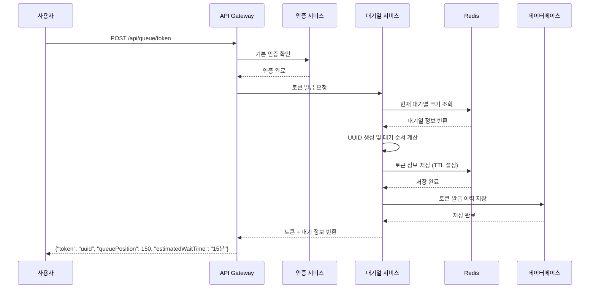
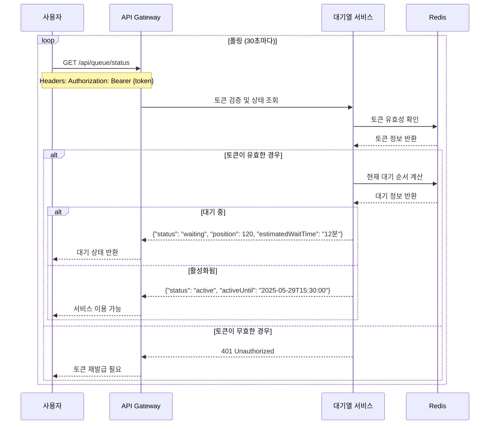
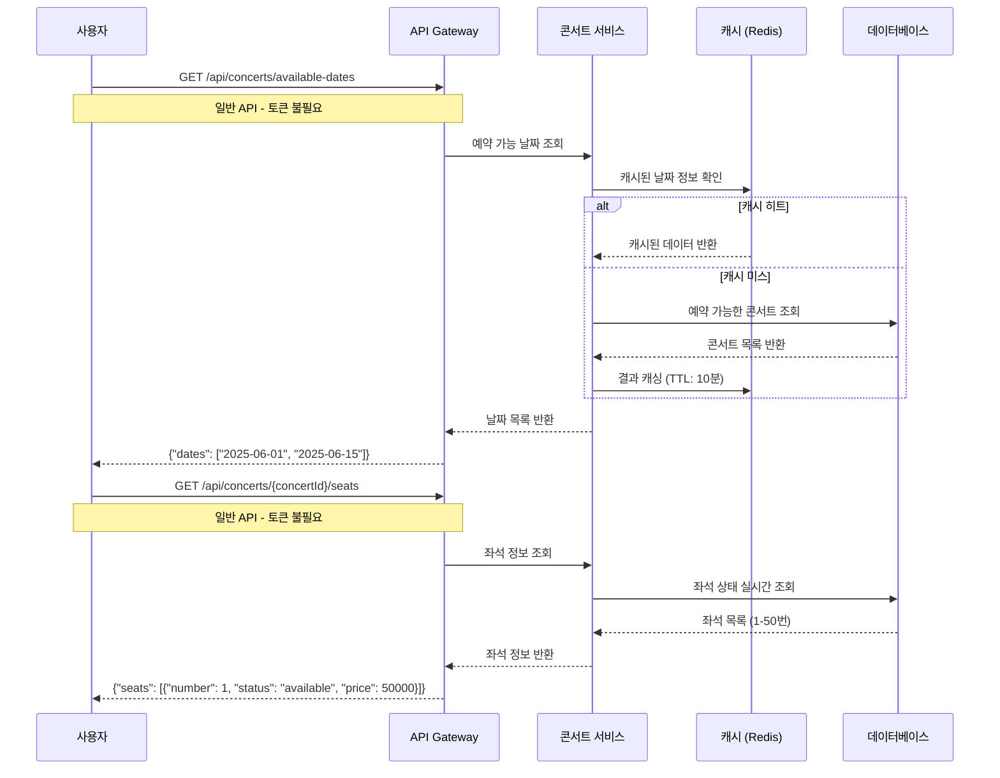
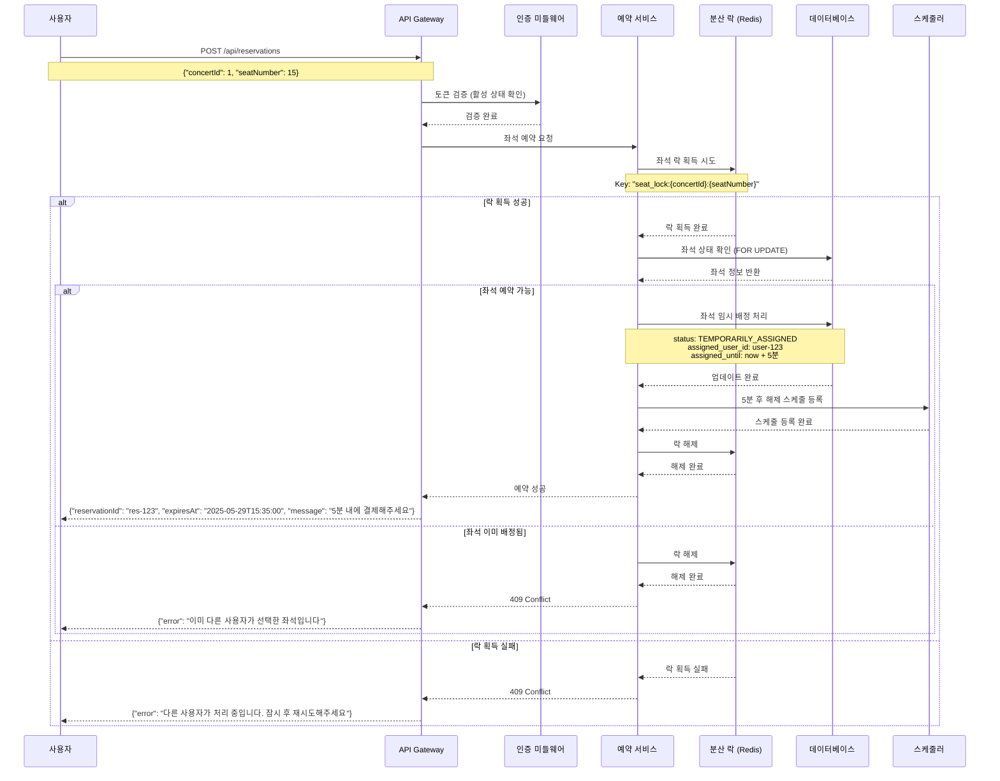
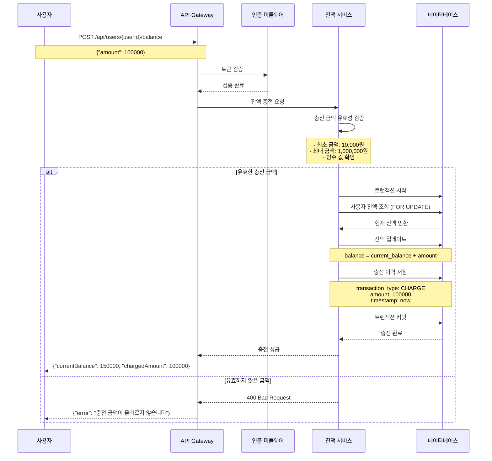
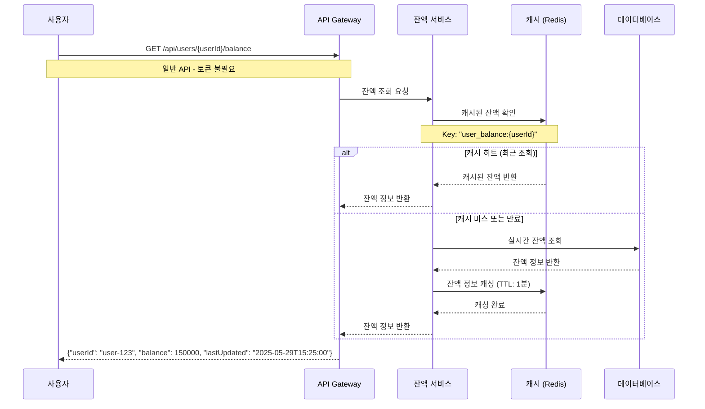
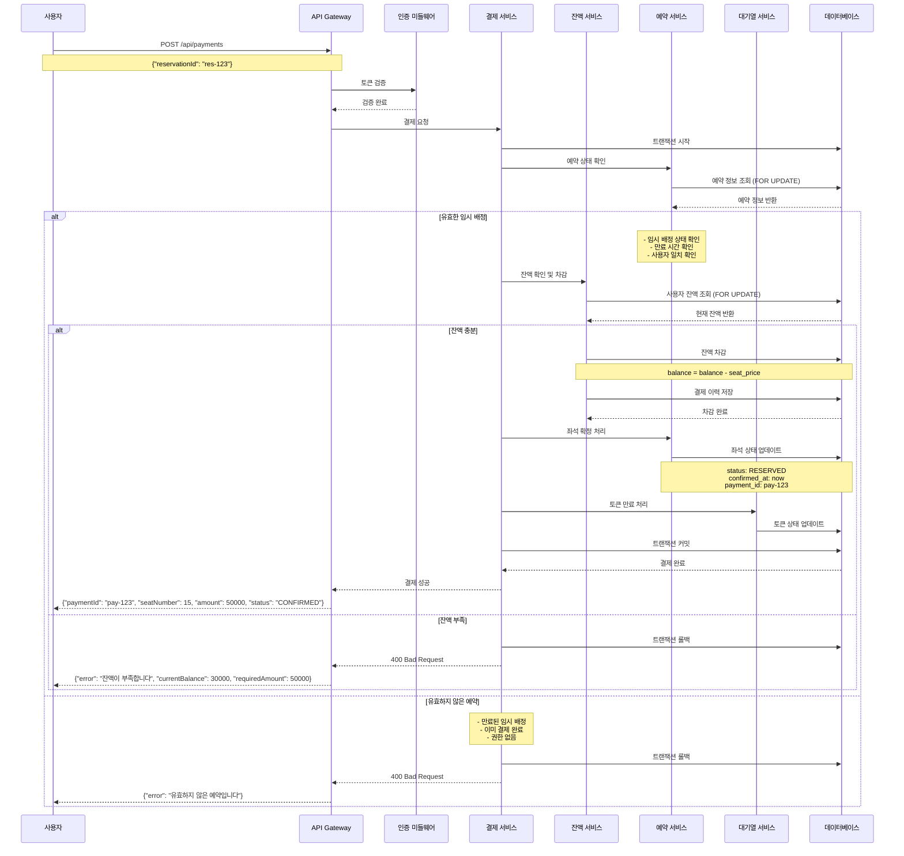
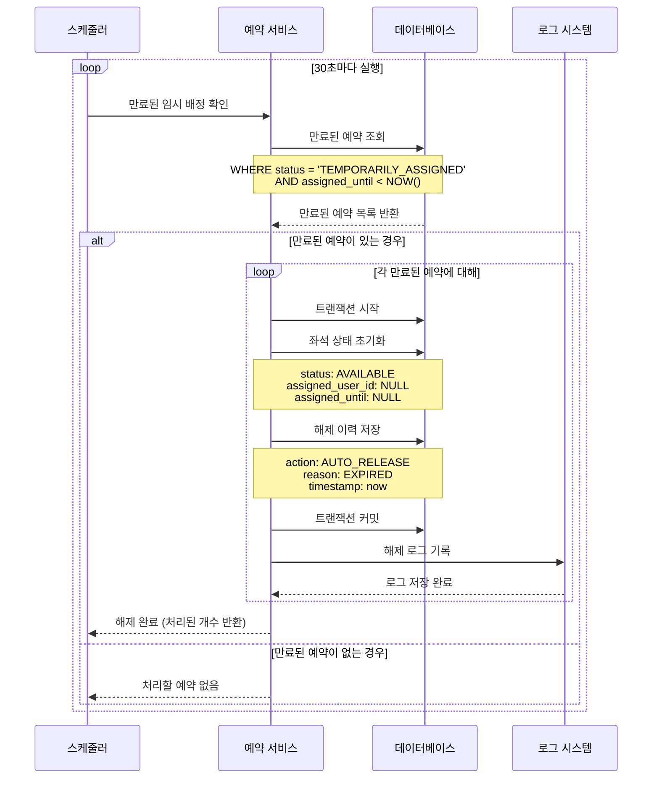
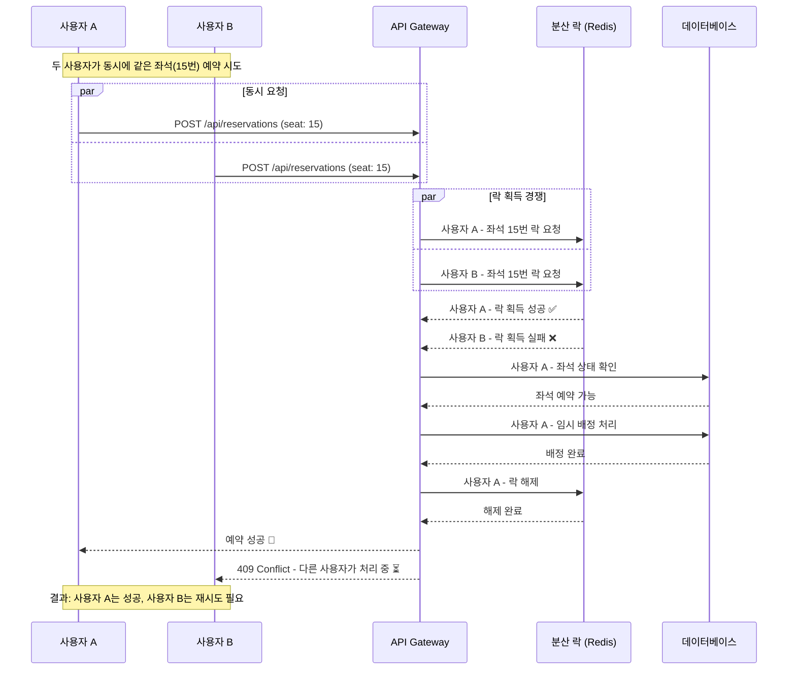

# 시퀀스 다이어그램 (Sequence Diagrams)

## 📋 개요

콘서트 예약 서비스의 주요 API 플로우를 시각화한 시퀀스 다이어그램입니다.
각 다이어그램은 사용자와 시스템 간의 상호작용을 시간 순서대로 보여줍니다.

# 시퀀스 다이어그램 분류 요약

## 🔒 대기열 필요 API
- **4. 좌석 예약 요청** - 한정된 자원에 대한 경쟁
- **5. 잔액 충전** - 중요한 금전 거래
- **7. 결제 처리** - 실제 거래 발생

## 🔓 일반 API (토큰 불필요)
- **1. 대기열 토큰 발급** - 대기열 진입용
- **2. 대기열 상태 조회** - 대기열 관리용
- **3. 콘서트 정보 조회** - 단순 정보 확인
- **6. 잔액 조회** - 상태 확인

---

## 🎫 1. 대기열 토큰 발급 플로우

사용자가 서비스 이용을 위해 대기열 토큰을 발급받는 과정

---

## 📅 2. 대기열 상태 조회 플로우

사용자가 폴링을 통해 대기열 상태를 확인하는 과정

---

## 🎵 3. 콘서트 정보 조회 플로우 🔓 (일반 API)

예약 가능한 날짜와 좌석 정보를 조회하는 과정 (대기열 토큰 불필요)

---

## 🪑 4. 좌석 예약 요청 플로우 🔒 (대기열 필요)

사용자가 좌석을 선택하고 임시 배정을 받는 과정 (대기열 토큰 필요)

---

## 💰 5. 잔액 충전 플로우 🔒 (대기열 필요)

사용자가 결제를 위해 잔액을 충전하는 과정 (대기열 토큰 필요)

---

## 💰 6. 잔액 조회 플로우 🔓 (일반 API)

사용자가 현재 잔액을 확인하는 과정 (대기열 토큰 불필요)

---

## 💳 7. 결제 처리 플로우 🔒 (대기열 필요)

임시 배정된 좌석에 대해 결제를 완료하는 과정 (대기열 토큰 필요)

---

## ⏰ 8. 임시 배정 자동 해제 플로우

스케줄러가 만료된 임시 배정을 자동으로 해제하는 과정

---

## 🚨 9. 동시성 충돌 시나리오

여러 사용자가 같은 좌석을 동시에 예약하려는 상황

---

## 📊 다이어그램 범례 (Legend)

### 참여자 (Participants)
- **사용자 (User)**: 서비스를 이용하는 고객
- **API Gateway**: REST API 엔드포인트
- **인증 미들웨어 (Auth)**: 토큰 검증 및 대기열 확인
- **각종 서비스**: 비즈니스 로직 처리 계층
- **Redis**: 캐시 및 분산 락
- **데이터베이스 (DB)**: 영속성 데이터 저장
- **스케줄러**: 백그라운드 작업 처리

### 메시지 유형
- **→**: 동기 호출
- **-->>**: 응답 반환
- **->>**: 비동기 호출

### 조건문
- **alt/else**: 조건 분기
- **loop**: 반복 처리
- **par**: 병렬 처리

---

## 📚 관련 문서

- [요구사항 명세서](./requirements.md)
- [API 명세서](./api-spec.md)
- [데이터베이스 ERD](./erd.md)
- [시스템 아키텍처](./architecture.md)